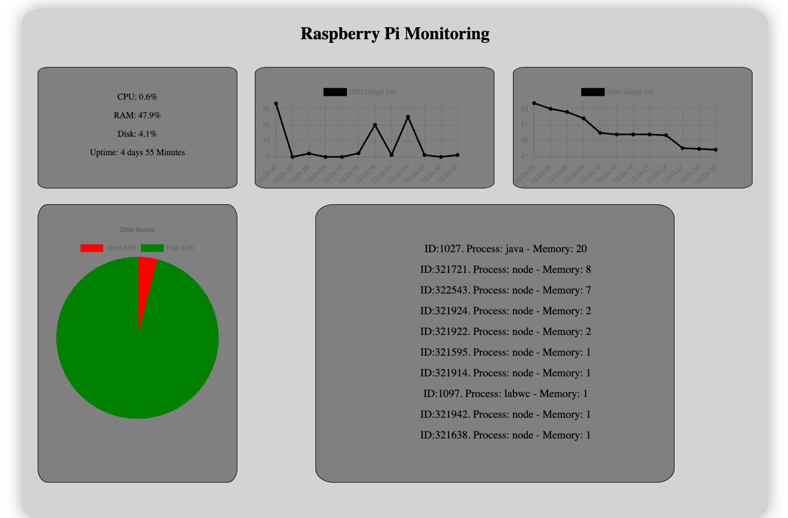

# Raspberry Pi Monitoring Service

A lightweight web-based monitoring service running on a Raspberry Pi.
The project focuses on backend development, API design, and deployment on embedded Linux hardware.

---

## Features (MVP)
- REST API providing system metrics:
  - CPU usage
  - Memory usage
  - Disk usage
  - System uptime
- Lightweight FastAPI backend
- Simple web interface displaying live data
- Deployed and running on a Raspberry Pi

---

## Tech Stack
- **Backend:** Python, FastAPI
- **System Metrics:** psutil
- **Frontend:** HTML, CSS, JavaScript
- **Deployment:** Raspberry Pi

## Screenshot

> Example of the web interface displaying top processes and system metrics.